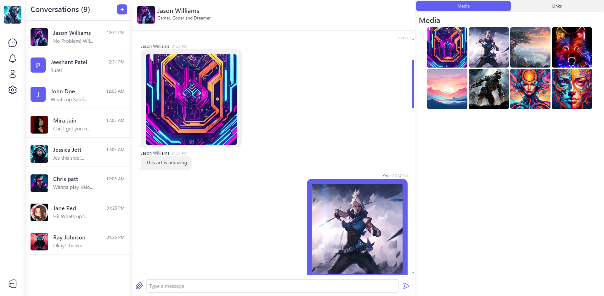

<div align="center">
    <h1> Nax-Chat </h1>
</div>

<h3 align="center"><a href="https://nax-chat.onrender.com">Visit this Project</a></h3

Nax-Chat is a secure real-time messaging application built with Node.js, Express, React, Socket.IO, and MongoDB. It features encrypted messaging, media sharing, and real-time updates.



## 💻 Technology

<p align="center">
  <a href="https://reactjs.org/">
    
  </a>
  <a href="https://nodejs.org/">
    
  </a>
  <a href="https://expressjs.com/">
    
  </a>
  <a href="https://socket.io/">
    
  </a>
  <a href="https://mongodb.com/">
    
  </a>
  <a href="https://cloudinary.com/">
    
  </a>
  <a href="https://jwt.io/">
    
  </a>
  <a href="https://tailwindcss.com/">
    
  </a>
  <a href="https://vitejs.dev/">
    
  </a>
  <a href="https://www.npmjs.com/package/crypto">
    
  </a>
  <a href="https://www.npmjs.com/package/bcrypt">
    
  </a>
  <a href="https://tanstack.com/query/latest">
    
  </a>
</p>

## 🛠️ Installation

To get started with the Nax-Chat Project, follow these steps:

1. Clone the repository to your local machine:

```sh
git clone https://github.com/SahilThakar11/Nax-Chat.git
```

2. Install backend dependencies

```sh
npm install
```

3. Start the Backend Server

```sh
npm run dev
```

## ⚙️ Configuration

Create a `.env` file in the root directory with the following content:

```
MONGO_URI=your_mongodb_uri
JWT_SECRET=your_jwt_secret
PORT=5000
NODE_ENV=development
CLOUDINARY_CLOUD_NAME=your_cloudinary_cloud_name
CLOUDINARY_API_KEY=your_cloudinary_api_key
CLOUDINARY_API_SECRET=your_cloudinary_api_secret
ENCRYPTION_KEY=your_base64_encryption_key
ENCRYPTION_IV=your_base64_encryption_iv
```

### Getting Your Credentials

- **MongoDB**: [Set up MongoDB Atlas](https://docs.atlas.mongodb.com/getting-started/)
- **Cloudinary**: [Create a Cloudinary account](https://cloudinary.com/) and find your credentials in the Dashboard.

### Generating Encryption Key and IV

To securely generate your `ENCRYPTION_KEY` and `ENCRYPTION_IV`, you can use the following commands:

1. **Generate a 256-bit (32 bytes) key for AES encryption**:

   ```bash
   openssl rand -base64 32
   ```

   This will output a base64-encoded string. Copy this string and use it as your ENCRYPTION_KEY.

2. **Generate a 128-bit (16 bytes) initialization vector (IV)**:

   ```bash
   openssl rand -base64 16
   ```

   This will output a base64-encoded string. Copy this string and use it as your ENCRYPTION_IV.

## 🔐 Encryption Details

Nax-Chat uses AES-256-CBC encyption for secuiring messages.

### Encryption Function

```js
const algorithm = "aes-256-cbc";
const key = Buffer.from(process.env.ENCRYPTION_KEY, "base64");
const iv = Buffer.from(process.env.ENCRYPTION_IV, "base64");

function encrypt(text) {
  const cipher = crypto.createCipheriv(algorithm, key, iv);
  let encrypted = cipher.update(text, "utf8", "hex");
  encrypted += cipher.final("hex");
  return encrypted;
}
```

### Decryption Function

```js
function decrypt(encrypted) {
  const decipher = crypto.createDecipheriv(algorithm, key, iv);
  let decrypted = decipher.update(encrypted, "hex", "utf8");
  decrypted += decipher.final("utf8");
  return decrypted;
}
```

## 🔌 Socket.io-client URL Changes

Chnage the following code in `frontend>src>socket>SocketContext.jsx` to use socket.io for localhost:

### **From:**

```js
const socket = io("https://nax-chat.onrender.com", {
  query: { userId: authUser.user._id },
});
```

### **To:**

```js
const socket = io("http://localhost:5000", {
  query: { userId: authUser.user._id },
});
```

To ensure the socket functionallity work on the localhost.

## 🚀 Running the Frontend

1. Get in frontend folder

   ```sh
   cd frontend
   ```

2. Install the dependencies

   ```sh
   npm install
   ```

3. Start the frontend

   ```sh
   npm run dev
   ```

This will start up the frontend server and make sure your backend server is running with the Frontend.
Visit `http://localhost:3000` to dive into the nax-chat web application.
